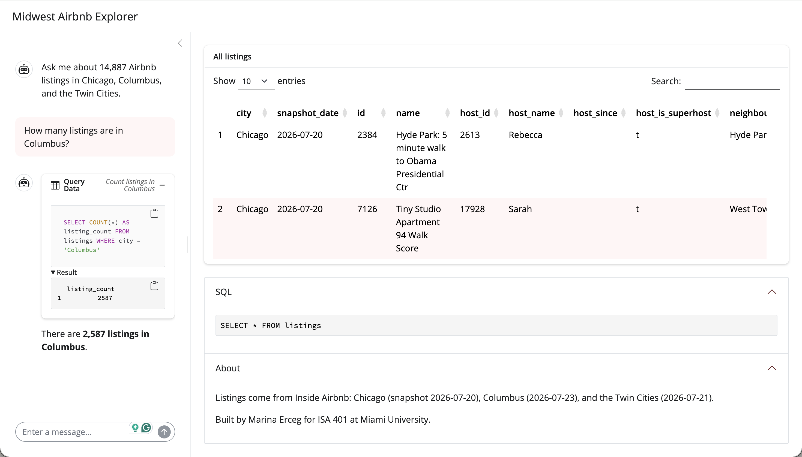
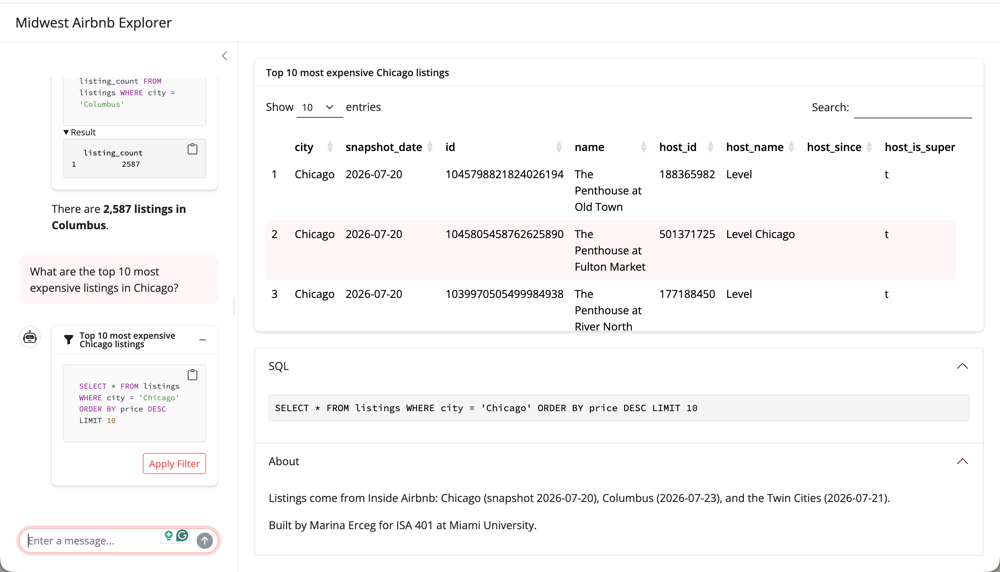
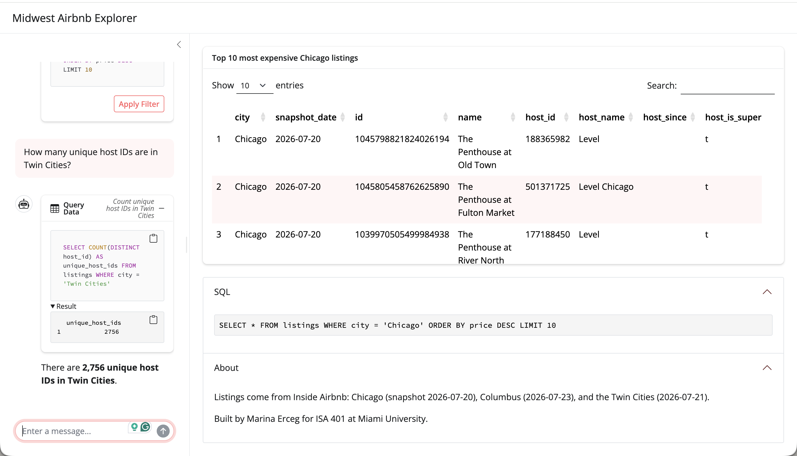

# [**Live app:**](https://business-intelligence-yurw.onrender.com)

Fall 2026 repo for in class code

## Tools

* Git
* GitHub
* R
* RStudio

## Example questions

**How many listings are in Columbus?**

**What are the top 10 most expensive listings in Chicago?**

**How many unique host IDs are in Twin Cities?**

